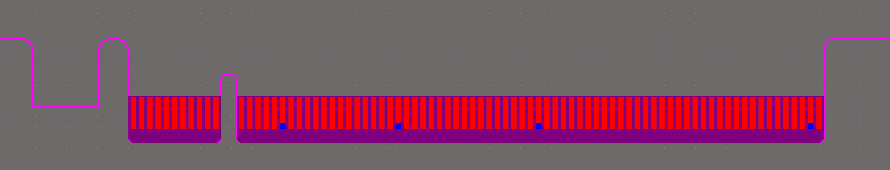

# Standard-Card-Footprints

This library contains standardized card designs. The outlines and edge connectors ("Gold Fingers") are modeled according to official specifications and provided in formats compatible with mainstream PCB design software.

> This is an open-source personal project, please double-check the layout or pin order with whatever you got. **I am not responsible for any losses resulting from errors of this library**